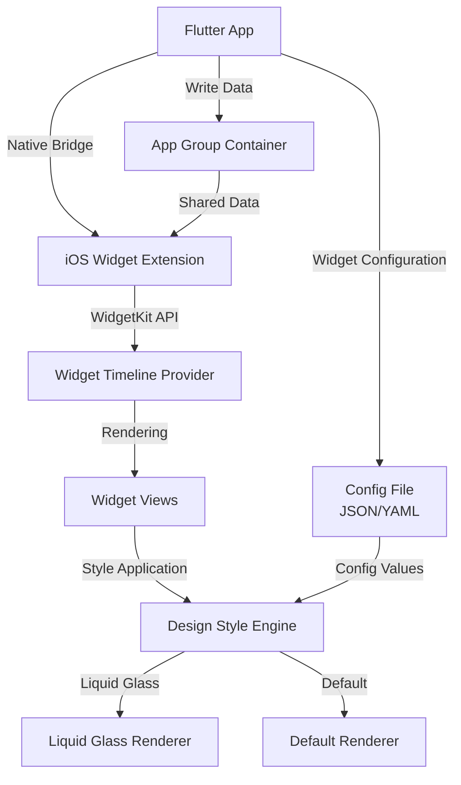
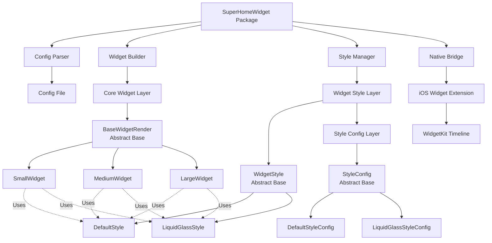
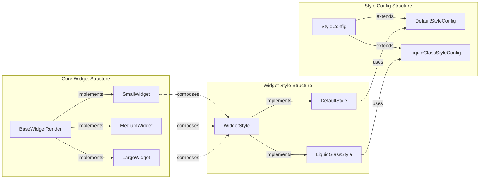
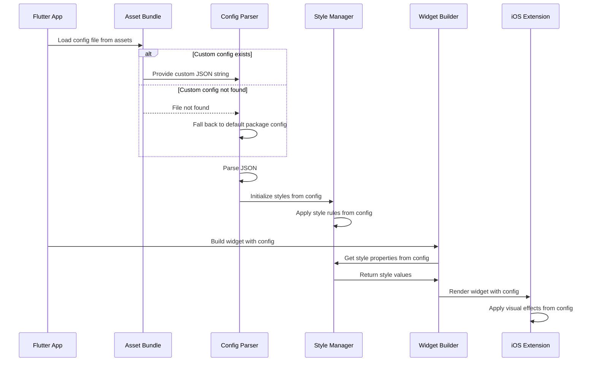
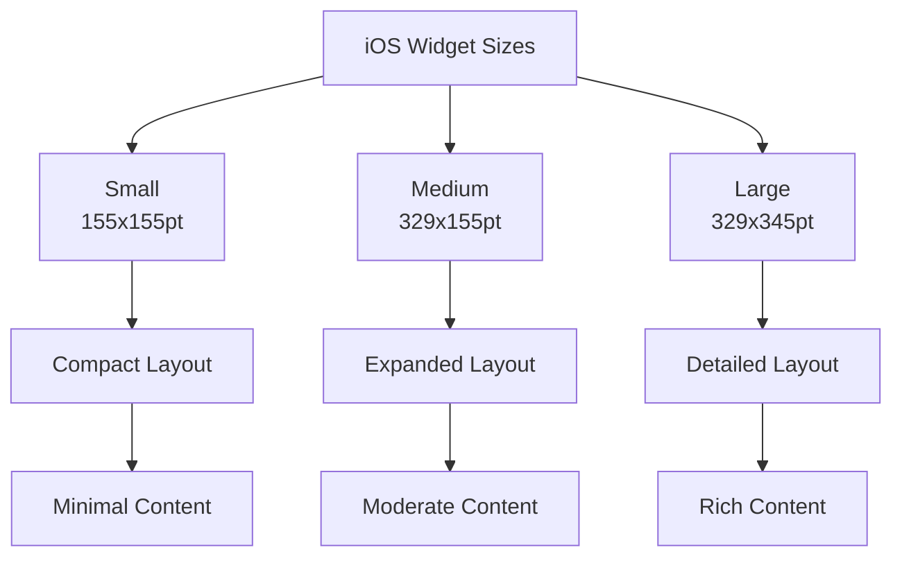
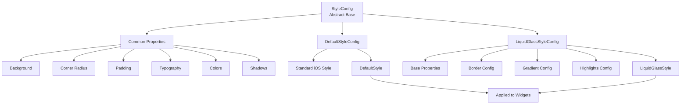
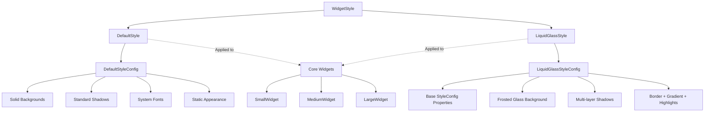
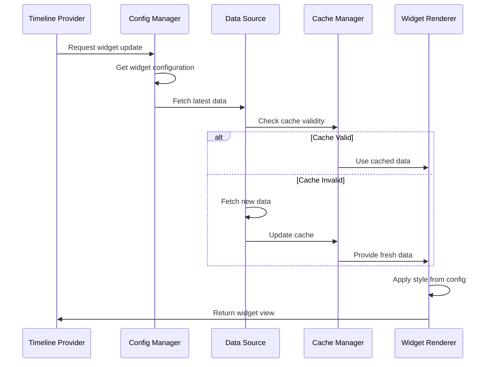
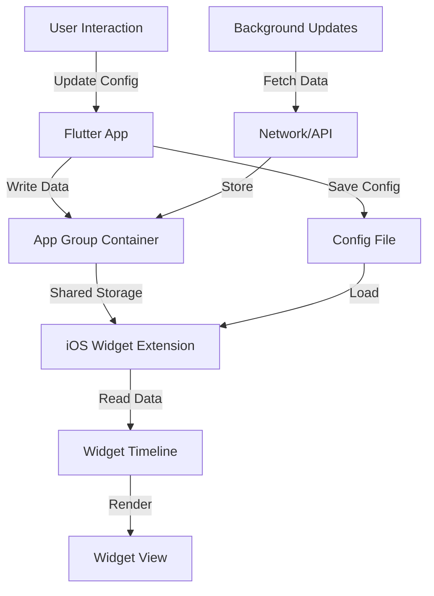
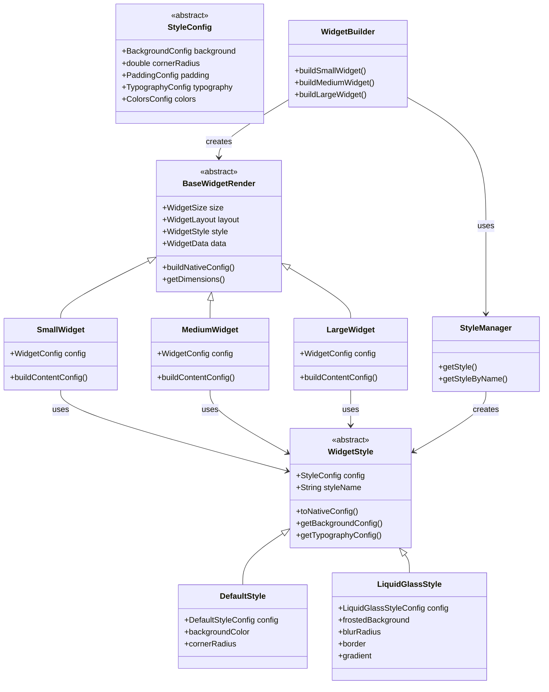

# Super Home Widget

[](https://pub.dev/packages/super_home_widget)
[](LICENSE)

A customizable iOS home screen widget package for Flutter using Apple's WidgetKit framework. Supports multiple design styles including default and liquid glass themes.

## Features

- 🎨 **Multiple Design Styles**: Default and Liquid Glass themes
- 📱 **iOS Native**: Built specifically for iOS using WidgetKit (iOS 14+)
- ⚙️ **Fully Configurable**: JSON-based configuration for all styles and behaviors
- 📐 **Multiple Widget Sizes**: Small, Medium, and Large widget support
- 🔄 **Timeline Updates**: Automatic widget refresh with configurable intervals
- 🌊 **Liquid Glass Effect**: Modern glassmorphic design with blur, gradients, and highlights

## Architecture

### High-Level Architecture



### Component Architecture



### Style-Widget Relationship



## Installation

Add this to your package's `pubspec.yaml` file:

```yaml
dependencies:
  super_home_widget: ^1.0.0
```

Then run:

```bash
flutter pub get
```

> **Note:** Code generation is **NOT required**. This package uses manual JSON serialization. Just add the package and you're ready to go (after iOS setup).

## iOS Setup

### ⚠️ CRITICAL: Widget Extension Required

**You MUST create a Widget Extension target for the widget to appear on the iOS home screen.**

Without a Widget Extension target, the widget will NOT appear in the "Add Widget" screen.

**📖 Detailed setup guide:** [WIDGET_SETUP.md](WIDGET_SETUP.md)

**⚡ Quick start:**
1. Open `example/ios/Runner.xcworkspace` in Xcode
2. **File > New > Target** > Create **Widget Extension**
3. Add Swift files to Widget Extension target
4. Add App Group capability to both targets
5. Build and run

**See WIDGET_SETUP.md for detailed steps.**

### 1. Add Widget Extension Target

In Xcode, add a new Widget Extension target to your iOS app:

1. File → New → Target
2. Select "Widget Extension"
3. Name it (e.g., "SuperHomeWidgetExtension")

### 2. Configure App Groups

1. In your main app target, go to Signing & Capabilities
2. Add "App Groups" capability
3. Create a new group (e.g., `group.com.yourcompany.yourapp.widget`)
4. Add the same App Group to your Widget Extension target

### 3. Copy Swift Files

Copy the following files from the package's `ios/` folder to your Widget Extension:

- `Classes/WidgetTimelineProvider.swift`
- `Classes/WidgetView.swift`
- `Classes/StyleRenderer.swift`
- `WidgetExtension/WidgetBundle.swift`

### 4. Update App Group ID

In `WidgetBundle.swift`, update the `appGroupId`:

```swift
private let appGroupId = "group.com.yourcompany.yourapp.widget"
```

## Usage

### Basic Initialization

```dart
import 'package:super_home_widget/super_home_widget.dart';

void main() async {
  WidgetsFlutterBinding.ensureInitialized();
  
  // Initialize the widget system
  await SuperHomeWidget.initialize(
    appGroupId: 'group.com.yourcompany.yourapp.widget',
  );
  
  runApp(MyApp());
}
```

### Update Widget Data

```dart
// Update data displayed in widgets
await SuperHomeWidget.updateData(WidgetData(
  title: 'Hello World',
  subtitle: 'Welcome to widgets',
  body: 'This is the main content',
  iconName: 'star.fill', // SF Symbol name
));
```

### Refresh Widgets

```dart
// Refresh all widgets
await SuperHomeWidget.refresh();

// Refresh specific widget size
await SuperHomeWidget.refresh(size: WidgetSize.small);
```

### Working with Styles

```dart
// Get style for a specific widget size
final style = SuperHomeWidget.getStyleForSize(WidgetSize.medium);

// Access style manager
final styleManager = SuperHomeWidget.styleManager;
final liquidGlass = styleManager?.liquidGlassStyle;
```

### Shared Data Storage

```dart
// Save data to shared container (accessible by widget extension)
await SuperHomeWidget.saveSharedData('user_name', 'John Doe');

// Read data from shared container
final name = await SuperHomeWidget.readSharedData('user_name');

// Delete data
await SuperHomeWidget.deleteSharedData('user_name');
```

### Listen for Widget Interactions

```dart
SuperHomeWidget.onWidgetClicked.listen((event) {
  print('Widget ${event.size} clicked!');
  print('Action: ${event.action}');
});
```

## Configuration

The widget system is configured via JSON. Default configuration is included, but you can customize it:

### Custom Configuration

```dart
await SuperHomeWidget.initialize(
  appGroupId: 'group.com.yourcompany.yourapp.widget',
  configPath: 'assets/custom_widget_config.json',
);
```

### Configuration Flow



### Configuration Structure

```json
{
  "widget": {
    "id": "super_home_widget",
    "name": "Super Home Widget",
    "version": "1.0.0"
  },
  "styles": {
    "default": {
      "background": {
        "type": "solid",
        "color": "#FFFFFF",
        "opacity": 1.0
      },
      "cornerRadius": 16,
      "typography": {
        "fontFamily": "SF Pro",
        "titleSize": 20,
        "bodySize": 14,
        "captionSize": 12
      },
      "colors": {
        "primary": "#007AFF",
        "secondary": "#5856D6",
        "text": "#000000",
        "textSecondary": "#8E8E93"
      }
    },
    "liquidGlass": {
      "background": {
        "type": "frosted",
        "style": "systemMaterial",
        "opacity": 0.85,
        "blurRadius": 20
      },
      "cornerRadius": 20,
      "border": {
        "enabled": true,
        "width": 1.5,
        "color": "#FFFFFF",
        "opacity": 0.3
      },
      "gradient": {
        "enabled": true,
        "colors": ["#00D9FF20", "#FF6B9D20"],
        "angle": 135
      }
    }
  },
  "widgets": {
    "small": {
      "style": "default",
      "layout": "compact",
      "refreshInterval": 3600
    },
    "medium": {
      "style": "liquidGlass",
      "layout": "expanded",
      "refreshInterval": 1800
    },
    "large": {
      "style": "liquidGlass",
      "layout": "detailed",
      "refreshInterval": 900
    }
  }
}
```

## Widget Sizes

| Size | iPhone Dimensions | iPad Dimensions | Layout |
|------|-------------------|-----------------|--------|
| Small | 155×155 pt | 170×170 pt | Compact |
| Medium | 329×155 pt | 364×170 pt | Expanded |
| Large | 329×345 pt | 364×376 pt | Detailed |



## Design Styles

### Style Architecture



### Default Style

Clean, standard iOS widget appearance following Apple's Human Interface Guidelines:

- Solid backgrounds
- System fonts (SF Pro)
- Standard shadows
- 8pt grid system

### Liquid Glass Style

Modern glassmorphic effect with:

- Frosted glass background with blur
- Translucent layers
- Gradient overlays
- Reflective highlights
- Multi-layer shadows
- Subtle borders

### Style Comparison



## Data Flow

### Widget Update Flow



### Data Sharing Architecture



## Technical Specifications

### Class Diagram



### iOS Requirements

- **Minimum iOS Version**: iOS 14.0+
- **Framework**: WidgetKit
- **App Groups**: Required for data sharing between app and widget extension
- **Capabilities**: 
  - Background Modes (Background fetch)
  - App Groups
  - Widget Extension target

### Flutter Integration

- **Platform Channels**: Method channels for Flutter-to-native communication
  - Method channel: `com.superhomewidget/widget`
  - Event channel: `com.superhomewidget/events`
- **Native Bridge**: `IOSBridge` class (singleton) handles all native communication
- **App Groups**: For data sharing with widget extension (UserDefaults with suite name)
- **No Code Generation Required**: All JSON serialization is manual (`fromJson`/`toJson`)

## Example

Check the `/example` folder for a complete implementation example.

## Requirements

- **iOS 14.0+** (WidgetKit minimum requirement)
- **Flutter SDK 3.10.4+**
- **Xcode 14+**

**Important**: Your app's iOS deployment target must be set to **iOS 14.0 or higher**:
- In `ios/Podfile`: `platform :ios, '14.0'`
- In Xcode project: `IPHONEOS_DEPLOYMENT_TARGET = 14.0`

## License

BSD 3-Clause License - see [LICENSE](LICENSE) for details.

## Author

Nurhayat Yurtaslan

## Contributing

Contributions are welcome! Please read our contributing guidelines before submitting a pull request.
