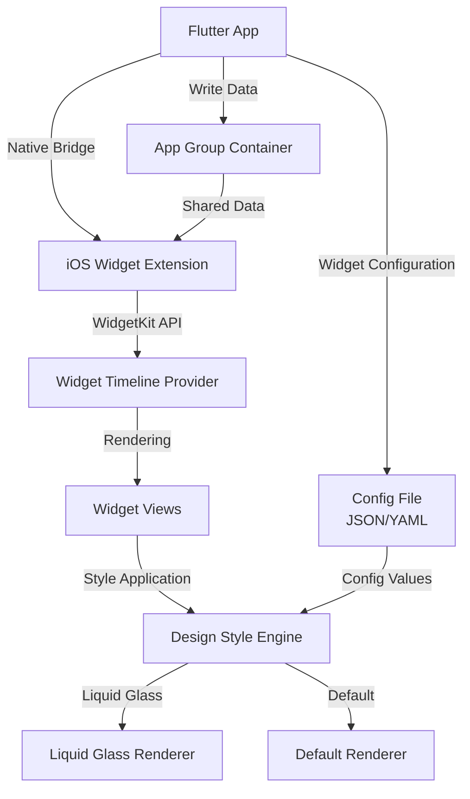
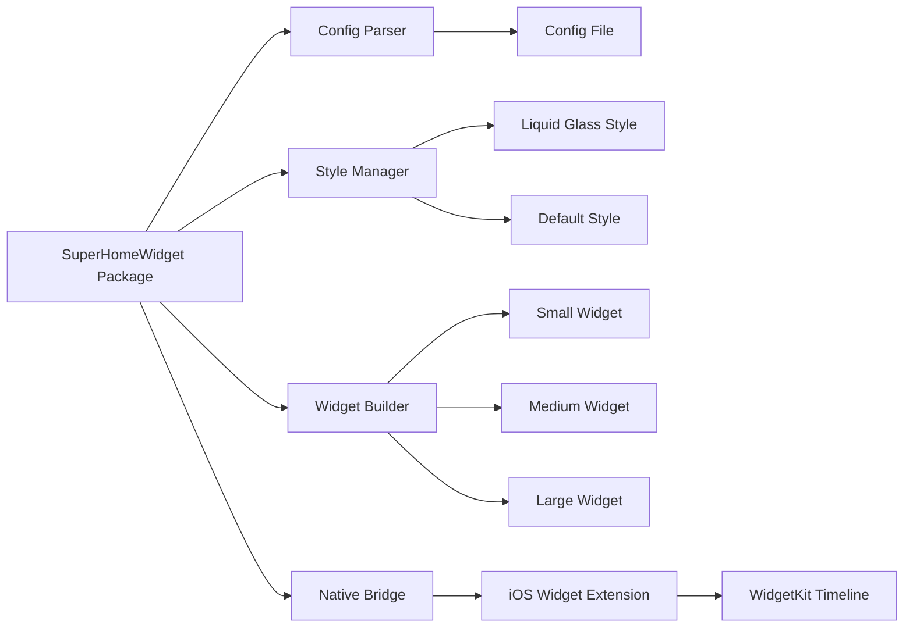
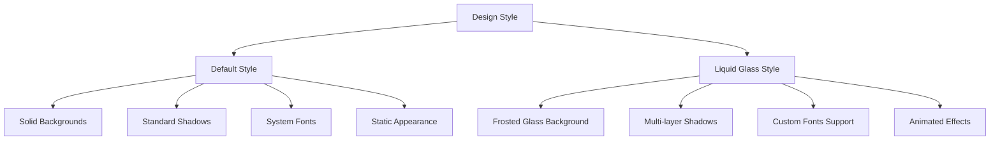
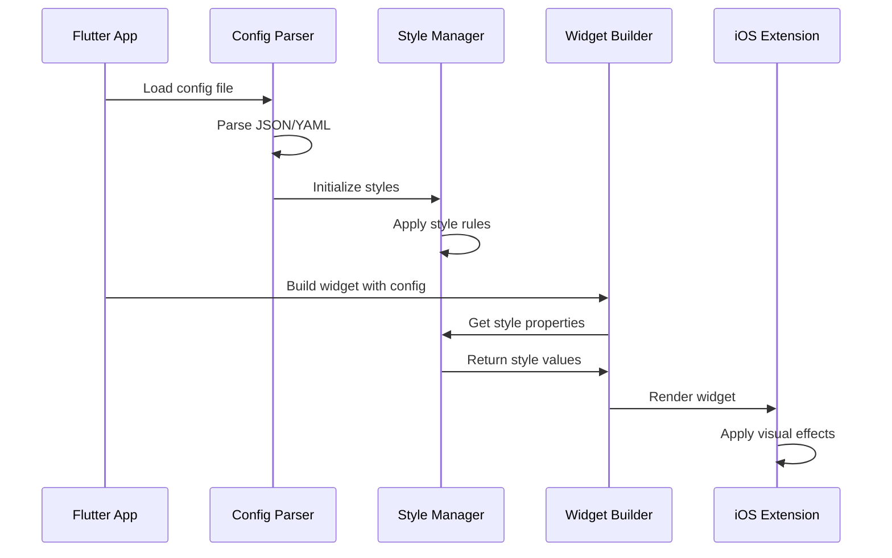
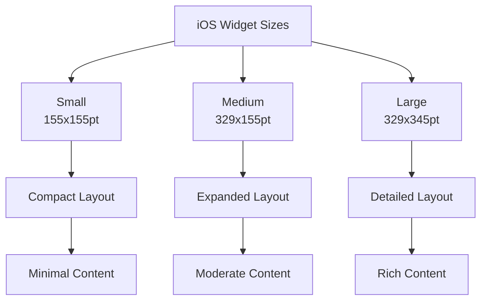
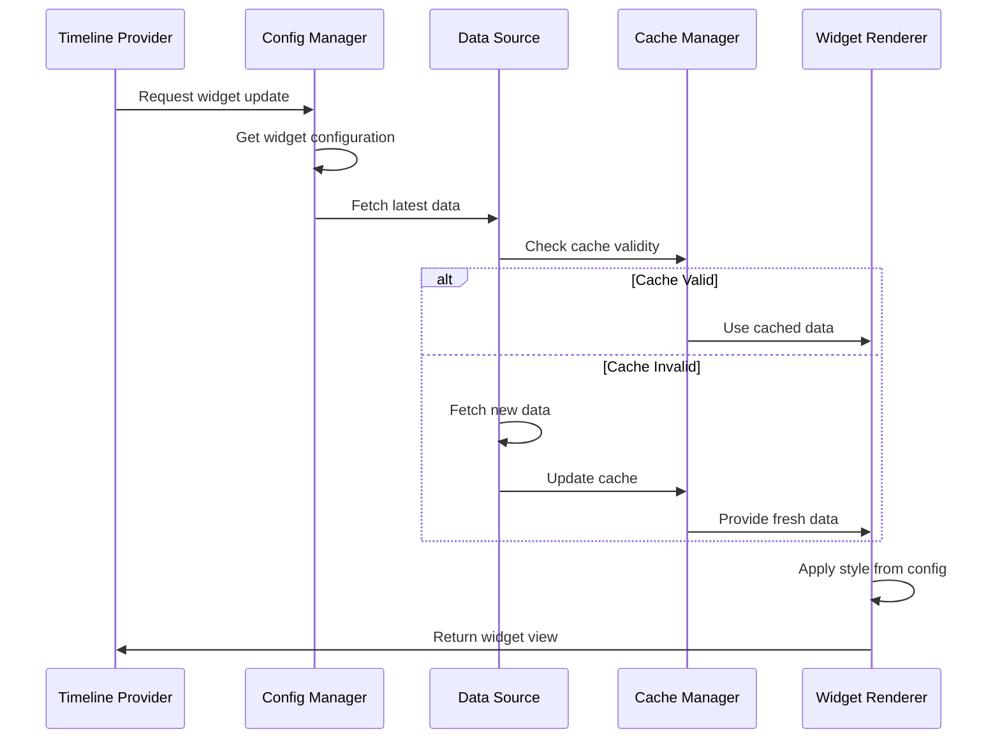
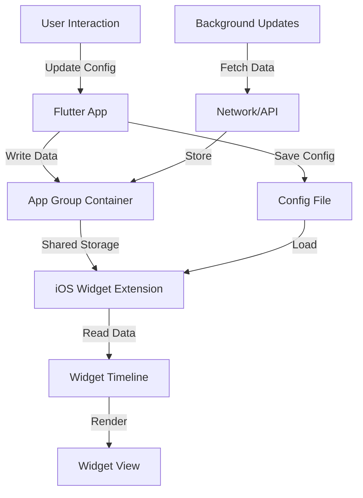
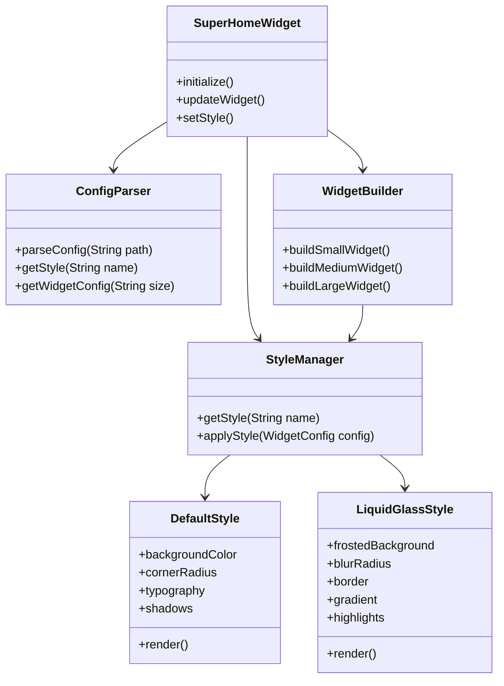
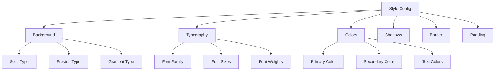
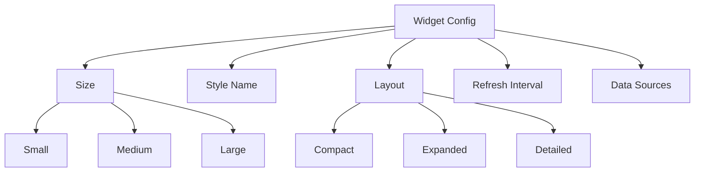

# Super Home Widget - iOS Analysis Document

## Table of Contents
1. [Overview](#overview)
2. [Architecture](#architecture)
3. [Design Styles](#design-styles)
4. [Configuration System](#configuration-system)
5. [Widget Types & Sizes](#widget-types--sizes)
6. [Data Flow](#data-flow)
7. [Implementation Details](#implementation-details)
8. [Technical Specifications](#technical-specifications)

---

## Overview

Super Home Widget is a Flutter package designed exclusively for iOS devices that provides customizable home screen widgets using Apple's WidgetKit framework. The package supports multiple design styles and configurations, allowing developers to create beautiful, configurable widgets that can be easily customized through a centralized configuration file.

### Key Features
- **iOS Exclusive**: Built specifically for iOS using WidgetKit
- **Multiple Design Styles**: Supports `liquid glass` and `default` design themes
- **Configurable**: All values, styles, and behaviors are driven from a configuration file
- **Multiple Widget Variants**: Supports different widget sizes and types
- **Dynamic Content**: Supports real-time data updates

### Target Platform
- **iOS**: iOS 14.0+ (WidgetKit minimum requirement)
- **Flutter**: Compatible with Flutter SDK 3.10.4+

---

## Architecture

### High-Level Architecture



### Component Architecture



---

## Design Styles

### 1. Default Style

The default style provides a clean, standard iOS widget appearance following Apple's Human Interface Guidelines.

**Characteristics:**
- Standard iOS system fonts (SF Pro)
- Native iOS color schemes
- Standard corner radius (8pt)
- System-standard shadows and blur effects
- Material Design-inspired spacing

**Visual Elements:**
- Background: Solid colors or subtle gradients
- Typography: SF Pro family with standard weights
- Spacing: 8pt grid system
- Borders: Optional subtle borders
- Shadows: System-standard depth shadows

### 2. Liquid Glass Style

The liquid glass style creates a modern, glassmorphic effect with frosted glass appearance and fluid animations.

**Characteristics:**
- Frosted glass background with blur effects
- Translucent layers with backdrop filters
- Smooth, fluid animations
- Gradient overlays
- Reflective highlights
- Dynamic light effects

**Visual Elements:**
- Background: Frosted glass with `UIVisualEffectView` blur
- Opacity: 0.7-0.9 range for glass effect
- Border: Subtle light borders (1-2pt)
- Shadows: Multi-layer shadows for depth
- Gradients: Subtle color overlays
- Highlights: Reflective light effects

### Style Comparison



---

## Configuration System

### Configuration File Structure

The configuration file (JSON format) serves as the single source of truth for all widget properties, styles, and behaviors.

```json
{
  "widget": {
    "id": "super_home_widget",
    "name": "Super Home Widget",
    "version": "1.0.0"
  },
  "styles": {
    "default": {
      "background": {
        "type": "solid",
        "color": "#FFFFFF",
        "opacity": 1.0
      },
      "cornerRadius": 16,
      "padding": {
        "horizontal": 16,
        "vertical": 12
      },
      "typography": {
        "fontFamily": "SF Pro",
        "titleSize": 20,
        "bodySize": 14,
        "captionSize": 12
      },
      "colors": {
        "primary": "#007AFF",
        "secondary": "#5856D6",
        "text": "#000000",
        "textSecondary": "#8E8E93"
      },
      "shadows": {
        "enabled": true,
        "opacity": 0.1,
        "radius": 8,
        "offset": {
          "x": 0,
          "y": 2
        }
      }
    },
    "liquidGlass": {
      "background": {
        "type": "frosted",
        "style": "systemMaterial",
        "opacity": 0.85,
        "blurRadius": 20
      },
      "cornerRadius": 20,
      "padding": {
        "horizontal": 20,
        "vertical": 16
      },
      "border": {
        "enabled": true,
        "width": 1.5,
        "color": "#FFFFFF",
        "opacity": 0.3
      },
      "typography": {
        "fontFamily": "SF Pro Rounded",
        "titleSize": 22,
        "bodySize": 15,
        "captionSize": 13
      },
      "colors": {
        "primary": "#00D9FF",
        "secondary": "#FF6B9D",
        "text": "#FFFFFF",
        "textSecondary": "#FFFFFF80"
      },
      "shadows": {
        "enabled": true,
        "layers": [
          {
            "opacity": 0.2,
            "radius": 12,
            "offset": { "x": 0, "y": 4 }
          },
          {
            "opacity": 0.1,
            "radius": 6,
            "offset": { "x": 0, "y": 2 }
          }
        ]
      },
      "gradient": {
        "enabled": true,
        "colors": ["#00D9FF20", "#FF6B9D20"],
        "angle": 135
      },
      "highlights": {
        "enabled": true,
        "opacity": 0.4,
        "position": "top-left"
      }
    }
  },
  "widgets": {
    "small": {
      "style": "default",
      "layout": "compact",
      "refreshInterval": 3600
    },
    "medium": {
      "style": "liquidGlass",
      "layout": "expanded",
      "refreshInterval": 1800
    },
    "large": {
      "style": "liquidGlass",
      "layout": "detailed",
      "refreshInterval": 900
    }
  },
  "data": {
    "sources": [],
    "updateStrategy": "timeline",
    "cacheDuration": 300
  }
}
```

### Configuration Flow



---

## Widget Types & Sizes

### iOS Widget Sizes

iOS WidgetKit supports three standard widget sizes:

1. **Small Widget** (2x2 grid cells)
   - Dimensions: ~155x155 points (iPhone)
   - Use case: Quick glance information
   - Content: Minimal, essential data only

2. **Medium Widget** (4x2 grid cells)
   - Dimensions: ~329x155 points (iPhone)
   - Use case: Detailed information display
   - Content: Expanded data with more context

3. **Large Widget** (4x4 grid cells)
   - Dimensions: ~329x345 points (iPhone)
   - Use case: Comprehensive information display
   - Content: Full details with rich content

### Widget Size Comparison



### Widget Variants

Each widget size can have multiple variants based on:
- **Content Type**: Different data displays
- **Layout Style**: Different arrangement of elements
- **Design Style**: Default or Liquid Glass

---

## Data Flow

### Widget Update Flow



### Data Sharing Architecture



---

## Implementation Details

### File Structure

```
super_home_widget/
├── lib/
│   ├── super_home_widget.dart          # Main package entry
│   ├── config/
│   │   ├── config_parser.dart          # Config file parser
│   │   └── config_model.dart          # Config data models
│   ├── styles/
│   │   ├── style_manager.dart         # Style management
│   │   ├── default_style.dart         # Default style implementation
│   │   └── liquid_glass_style.dart    # Liquid glass style implementation
│   ├── widgets/
│   │   ├── widget_builder.dart        # Widget construction
│   │   ├── small_widget.dart          # Small widget implementation
│   │   ├── medium_widget.dart         # Medium widget implementation
│   │   └── large_widget.dart          # Large widget implementation
│   └── native/
│       └── ios_bridge.dart            # iOS native bridge
├── ios/
│   ├── Classes/
│   │   ├── WidgetTimelineProvider.swift
│   │   ├── WidgetView.swift
│   │   └── StyleRenderer.swift
│   └── WidgetExtension/
│       └── WidgetBundle.swift
└── config/
    └── widget_config.json            # Default configuration file
```

### Class Diagram



---

## Technical Specifications

### iOS Requirements

- **Minimum iOS Version**: iOS 14.0+
- **Framework**: WidgetKit
- **App Groups**: Required for data sharing between app and widget extension
- **Capabilities**: 
  - Background Modes (Background fetch)
  - App Groups
  - Widget Extension target

### Flutter Integration

- **Platform Channels**: Method channels for Flutter-to-native communication
- **Event Channels**: For native-to-Flutter communication
- **Shared Preferences**: For configuration storage
- **App Groups**: For data sharing with widget extension

### Performance Considerations

1. **Widget Refresh Limits**
   - iOS limits widget updates to preserve battery
   - Timeline-based updates recommended
   - Maximum refresh interval: 15 minutes

2. **Memory Constraints**
   - Widget extensions have limited memory
   - Efficient image caching required
   - Optimize rendering operations

3. **Rendering Performance**
   - Liquid glass effects can be computationally expensive
   - Use efficient blur algorithms
   - Cache rendered views when possible

### Security Considerations

- Configuration files should be validated
- Sanitize user-provided data
- Secure storage for sensitive information
- App Group container security

---

## Configuration Schema Reference

### Style Configuration Schema



### Widget Configuration Schema



---

## Future Enhancements

### Potential Features

1. **Additional Design Styles**
   - Dark mode variants
   - Custom theme support
   - Animated style transitions

2. **Advanced Configurations**
   - Dynamic style switching
   - User-customizable themes
   - A/B testing support

3. **Performance Optimizations**
   - Lazy loading
   - Progressive rendering
   - Advanced caching strategies

4. **Developer Tools**
   - Config file validator
   - Style preview tool
   - Widget simulator

---

## Conclusion

Super Home Widget provides a flexible, configurable solution for iOS home screen widgets with support for multiple design styles. The configuration-driven approach allows for easy customization and maintenance, while the separation of concerns ensures clean architecture and extensibility.

The package leverages iOS WidgetKit's capabilities while providing a Flutter-friendly API, making it accessible to Flutter developers while maintaining native iOS performance and appearance standards.
