# Super Home Widget - iOS Analysis Document

## Table of Contents
1. [Overview](#overview)
2. [Architecture](#architecture)
3. [Design Styles](#design-styles)
4. [Configuration System](#configuration-system)
5. [Widget Types & Sizes](#widget-types--sizes)
6. [Data Flow](#data-flow)
7. [Implementation Details](#implementation-details)
   - [Current Architecture Issues & Proposed Improvements](#current-architecture-issues--proposed-improvements)
   - [Proposed Architecture Layers](#proposed-architecture-layers)
   - [Migration Strategy](#migration-strategy)
8. [Technical Specifications](#technical-specifications)

---

## Overview

Super Home Widget is a Flutter package designed exclusively for iOS devices that provides customizable home screen widgets using Apple's WidgetKit framework. The package supports multiple design styles and configurations, allowing developers to create beautiful, configurable widgets that can be easily customized through a centralized configuration file.

### Key Features
- **iOS Exclusive**: Built specifically for iOS using WidgetKit
- **Liquid Glass Design**: Supports liquid glass (glassmorphic) design style with optional solid background fallback
- **Configurable**: All values, styles, and behaviors are driven from a configuration file
- **Multiple Widget Variants**: Supports different widget sizes and types
- **Dynamic Content**: Supports real-time data updates

### Target Platform
- **iOS**: iOS 14.0+ (WidgetKit minimum requirement)
- **Flutter**: Compatible with Flutter SDK 3.10.4+

---

## Architecture

### High-Level Architecture

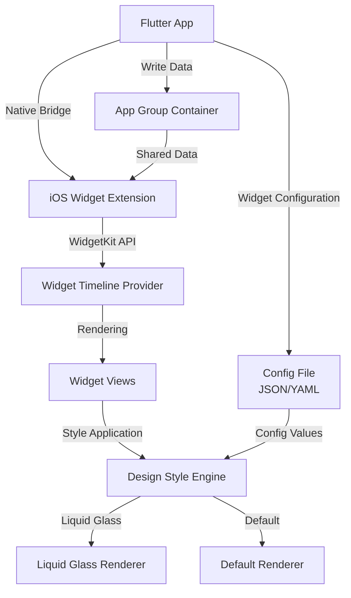

### Component Architecture

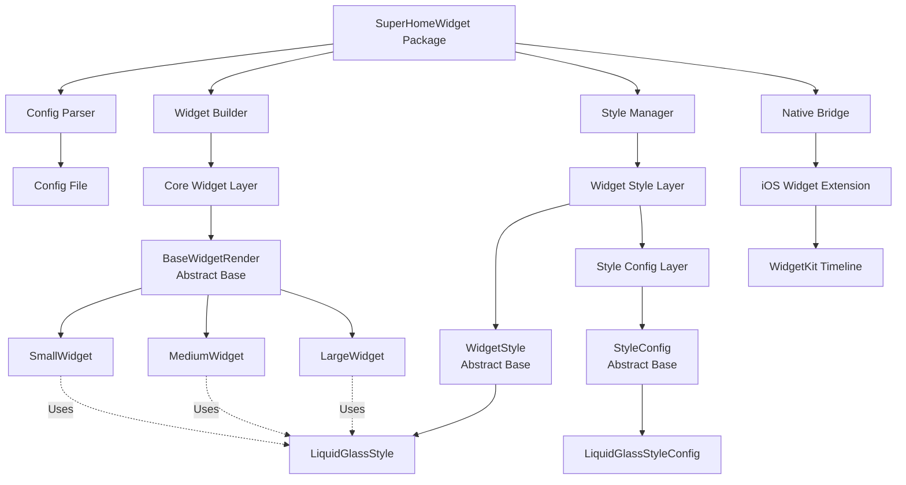

### Architecture Principles

#### 1. Core Widget Structure (Base Layer)

**Location**: `lib/widgets/`

The core widget structure is independent and handles widget-specific functionality:

**Base Classes** (`widget_builder.dart`):
- **`BaseWidgetRender`**: Abstract base class defining widget interface
  - Defined in: `lib/widgets/widget_builder.dart`
  - Properties: `WidgetSize size`, `WidgetLayout layout`, `WidgetStyle style`, `WidgetData? data`
  - Methods: `buildNativeConfig()`, `getDimensions({bool isIPad = false})`
  
- **`WidgetData`**: Widget data model
  - Defined in: `lib/widgets/widget_builder.dart`
  - Properties: `title`, `subtitle`, `body`, `imageUrl`, `iconName`, `customData`, `timestamp`
  
- **`WidgetDimensions`**: Dimension constants
  - Defined in: `lib/widgets/widget_builder.dart`
  - Provides iPhone/iPad dimensions for each widget size

**Concrete Widget Implementations**: 
- **`SmallWidget`**: `lib/widgets/small_widget.dart`
  - Implements `BaseWidgetRender`
  - Size: 155x155pt (iPhone) / 170x170pt (iPad)
  - Compact layout
  
- **`MediumWidget`**: `lib/widgets/medium_widget.dart`
  - Implements `BaseWidgetRender`
  - Size: 329x155pt (iPhone) / 364x170pt (iPad)
  - Expanded layout
  
- **`LargeWidget`**: `lib/widgets/large_widget.dart`
  - Implements `BaseWidgetRender`
  - Size: 329x345pt (iPhone) / 364x376pt (iPad)
  - Detailed layout

**Factory Class**:
- **`WidgetBuilder`**: `lib/widgets/widget_builder.dart`
  - Creates widget instances
  - Manages widget construction with styles

**Core widgets are responsible for:**
- Widget size and layout management
- Data structure and content organization
- Dimension calculations (iPhone/iPad)
- Native configuration building
- Content layout configuration

#### 2. Widget Style Structure (Derived Layer)

**Location**: `lib/styles/`

Widget styles are completely separate from core widgets and derive from a base style structure:

**Base Classes** (`style_manager.dart`):
- **`WidgetStyle`**: Abstract base class for all styles
  - Defined in: `lib/styles/style_manager.dart`
  - Properties: `StyleConfig config`, `String styleName`
  - Methods: `toNativeConfig()`, `getBackgroundConfig()`, `getTypographyConfig()`, `getShadowConfig()`, `getPaddingConfig()`

**Style Configuration Hierarchy** (`config/config_model.dart`):
- **`StyleConfig`** (abstract base): Common style properties
  - Defined in: `lib/config/config_model.dart`
  - Properties: `BackgroundConfig background`, `double cornerRadius`, `PaddingConfig padding`, `TypographyConfig typography`, `ColorsConfig colors`, `ShadowConfig shadows`
  
- **`LiquidGlassStyleConfig`** extends `StyleConfig`: Glassmorphic style
  - Defined in: `lib/config/config_model.dart`
  - Inherits all `StyleConfig` properties
  - Contains `liquidGlassEnabled` boolean (default: `true`)
  - Additional properties: `BorderConfig border`, `GradientConfig gradient`, `HighlightsConfig highlights`
  - When `liquidGlassEnabled: false`, uses solid background color from `background.color`

**Concrete Style Implementation**:
- **`LiquidGlassStyle`**: `lib/styles/liquid_glass_style.dart`
  - Implements `WidgetStyle` interface
  - Uses `LiquidGlassStyleConfig` (from `config/config_model.dart`)
  - Glassmorphic appearance when `liquidGlassEnabled: true`
  - Solid background when `liquidGlassEnabled: false`

**Factory Class**:
- **`StyleManager`**: `lib/styles/style_manager.dart`
  - Creates style instances
  - Manages style retrieval and application

**Styles are responsible for:**
- Visual appearance (backgrounds, colors, typography)
- Shadow and border effects
- Style-specific rendering properties
- Native style configuration generation

#### 3. Configuration Layer

**Location**: `lib/config/`

**Files**:
- **`config_model.dart`**: All configuration data models
  - `StyleConfig` abstract base class
   - `LiquidGlassStyleConfig` concrete config (with `liquidGlassEnabled` flag)
  - Supporting config classes (`BackgroundConfig`, `PaddingConfig`, etc.)
  - Enums: `WidgetSize`, `WidgetLayout`, `WidgetStyleType`
  - `WidgetConfig`, `WidgetsConfig`, `SuperHomeWidgetConfig`
  
- **`config_parser.dart`**: Configuration file parser
  - `ConfigParser` class
  - Loads JSON configuration files
  - Returns `SuperHomeWidgetConfig` instances

#### 4. Separation of Concerns

**File Organization**:
- **Core widgets** (`lib/widgets/`) and **widget styles** (`lib/styles/`) are in separate directories
- **Style configurations** (`lib/config/config_model.dart`) are separate from style implementations
- **Base classes** are defined in their respective layer files:
  - `BaseWidgetRender` in `widget_builder.dart`
  - `WidgetStyle` in `style_manager.dart`
  - `StyleConfig` in `config_model.dart`

**Architectural Principles**:
- Core widgets and widget styles are independent layers
- Styles derive from base style structure (`StyleConfig` hierarchy in `config_model.dart`)
- Widgets use styles through composition (not inheritance)
- Any widget can use any style
- Styles can be extended without modifying core widgets
- Configuration models are separate from implementations

### Style-Widget Relationship

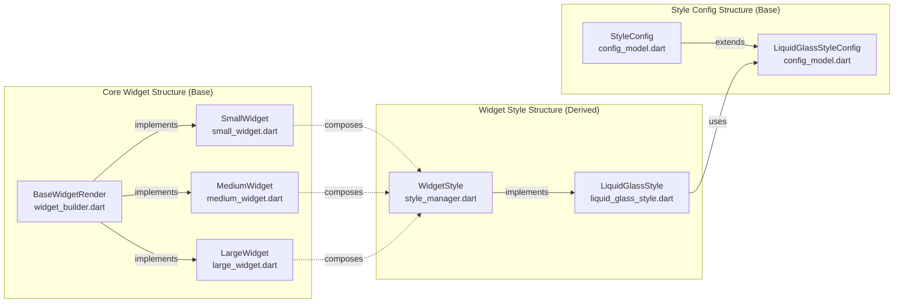

**File Locations & Relationships:**

1. **Core Widgets** (`lib/widgets/`):
   - `BaseWidgetRender` (abstract) → `widget_builder.dart`
   - `SmallWidget` → `small_widget.dart` (implements `BaseWidgetRender`)
   - `MediumWidget` → `medium_widget.dart` (implements `BaseWidgetRender`)
   - `LargeWidget` → `large_widget.dart` (implements `BaseWidgetRender`)

2. **Widget Styles** (`lib/styles/`):
   - `WidgetStyle` (abstract) → `style_manager.dart`
   - `LiquidGlassStyle` → `liquid_glass_style.dart` (implements `WidgetStyle`)

3. **Style Configurations** (`lib/config/config_model.dart`):
   - `StyleConfig` (abstract) → `config_model.dart`
   - `LiquidGlassStyleConfig` → `config_model.dart` (extends `StyleConfig`)
     - Contains `liquidGlassEnabled` boolean (default: `true`)
     - When `false`, uses solid background color from `background.color`

**Key Points:**
1. **Core widgets** implement `BaseWidgetRender` (defined in `widget_builder.dart`)
2. **Widget styles** implement `WidgetStyle` interface (defined in `style_manager.dart`)
3. **Style configs** extend `StyleConfig` base (defined in `config_model.dart`)
4. Styles use their respective config classes through composition
5. Widgets use styles through composition (not inheritance)
6. Styles are completely independent and can be applied to any widget
7. New styles can be created by:
   - Extending `StyleConfig` in `config_model.dart`
   - Implementing `WidgetStyle` in a new file in `styles/` directory
8. File organization follows clear separation:
   - Core widgets: `lib/widgets/`
   - Widget styles: `lib/styles/`
   - Configuration models: `lib/config/`

---

## Design Styles

### Style Architecture

The package uses a **single liquid glass style** with an optional solid background fallback. The liquid glass effect can be enabled or disabled, and when disabled, a solid background color is used instead.

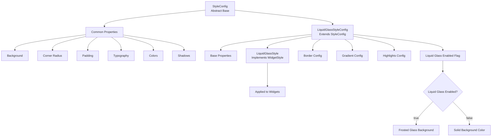

**Key Principles:**
- Single style: `LiquidGlassStyle` (no default style)
- Liquid glass effect is enabled by default (`liquidGlassEnabled: true`)
- When disabled, uses solid background color from configuration
- Style implementation implements `WidgetStyle` interface
- Core widgets use styles through composition, not inheritance

### Liquid Glass Style

The liquid glass style creates a modern, glassmorphic effect with frosted glass appearance and fluid animations. By default, the liquid glass effect is enabled, but it can be disabled to use a solid background color instead.

**Implementation:**
- **`LiquidGlassStyleConfig`** (`lib/config/config_model.dart`): Extends `StyleConfig` with glassmorphic properties
- **`LiquidGlassStyle`** (`lib/styles/liquid_glass_style.dart`): Implements `WidgetStyle` interface
- Uses `LiquidGlassStyleConfig` for configuration (composition)

**Liquid Glass Behavior:**
- **Default**: `liquidGlassEnabled: true` - Frosted glass effect with blur
- **When Disabled**: `liquidGlassEnabled: false` - Solid background color from `background.color`

**Characteristics (When Enabled):**
- Frosted glass background with blur effects
- Translucent layers with backdrop filters
- Smooth, fluid animations
- Gradient overlays
- Reflective highlights
- Dynamic light effects

**Characteristics (When Disabled):**
- Solid background color (from `background.color`)
- No blur effects
- Standard shadows and borders
- All other style properties remain the same

**Visual Elements (When Enabled):**
- Background: Frosted glass with `UIVisualEffectView` blur (iOS 15+) or manual blur (iOS 14)
- Opacity: 0.7-0.9 range for glass effect
- Border: Subtle light borders (1-2pt)
- Shadows: Multi-layer shadows for depth
- Gradients: Subtle color overlays
- Highlights: Reflective light effects

**Visual Elements (When Disabled):**
- Background: Solid color from `background.color` with `background.opacity`
- No blur effects
- Standard shadows
- All other visual elements remain the same

**Configuration Structure** (`lib/config/config_model.dart`):
```dart
LiquidGlassStyleConfig extends StyleConfig {
  // Inherited from StyleConfig
  BackgroundConfig background
  double cornerRadius
  PaddingConfig padding
  TypographyConfig typography
  ColorsConfig colors
  ShadowConfig shadows
  
  // Liquid glass control
  bool liquidGlassEnabled  // Default: true
  
  // Additional properties (used when liquidGlassEnabled: true)
  BorderConfig border
  GradientConfig gradient
  HighlightsConfig highlights
}
```

**File**: `lib/config/config_model.dart`

### Liquid Glass Control Flow

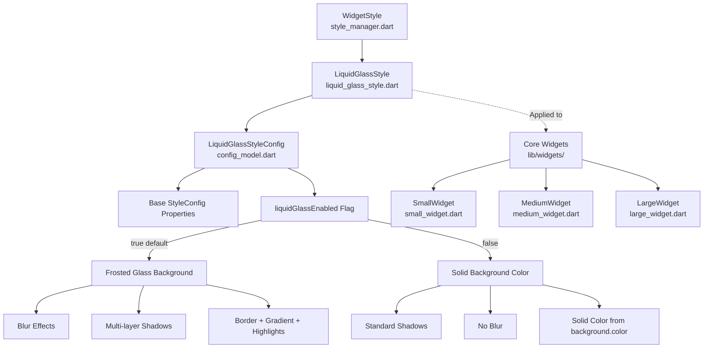

### Style Application Flow

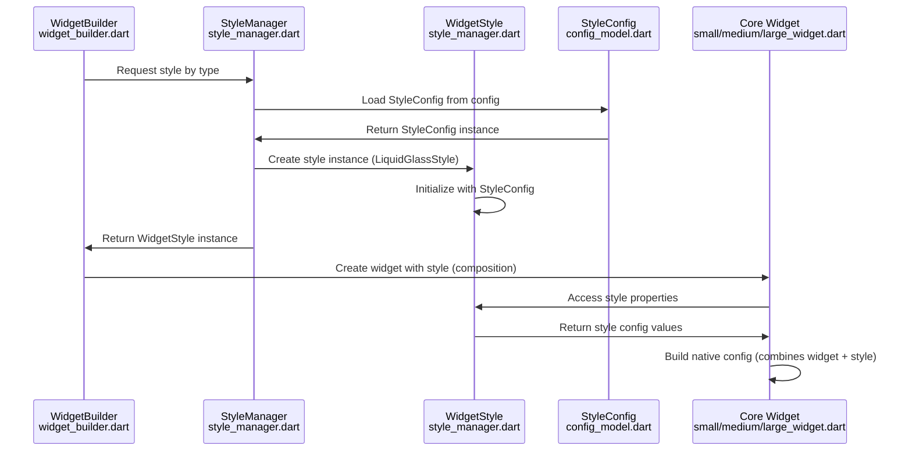

---

## Configuration System

### Configuration File Structure

The configuration file (JSON format) serves as the single source of truth for all widget properties, styles, and behaviors.

```json
{
  "widget": {
    "id": "super_home_widget",
    "name": "Super Home Widget",
    "version": "1.0.0"
  },
  "styles": {
    "liquidGlass": {
      "liquidGlassEnabled": true,
      "background": {
        "type": "frosted",
        "style": "systemMaterial",
        "color": "#FFFFFF",
        "opacity": 0.95,
        "blurRadius": 20
      },
      "cornerRadius": 20,
      "padding": {
        "horizontal": 20,
        "vertical": 16
      },
      "border": {
        "enabled": true,
        "width": 1.5,
        "color": "#FFFFFF",
        "opacity": 0.2
      },
      "typography": {
        "fontFamily": "SF Pro Rounded",
        "titleSize": 22,
        "bodySize": 15,
        "captionSize": 13
      },
      "colors": {
        "primary": "#007AFF",
        "secondary": "#5856D6",
        "text": "#1C1C1E",
        "textSecondary": "#3A3A3C"
      },
      "shadows": {
        "enabled": true,
        "layers": [
          {
            "opacity": 0.2,
            "radius": 12,
            "offset": { "x": 0, "y": 4 }
          },
          {
            "opacity": 0.1,
            "radius": 6,
            "offset": { "x": 0, "y": 2 }
          }
        ]
      },
      "gradient": {
        "enabled": false,
        "colors": [],
        "angle": 135
      },
      "highlights": {
        "enabled": true,
        "opacity": 0.4,
        "position": "top-left"
      }
    }
  },
  "widgets": {
    "small": {
      "style": "liquidGlass",
      "layout": "compact",
      "refreshInterval": 3600
    },
    "medium": {
      "style": "liquidGlass",
      "layout": "expanded",
      "refreshInterval": 1800
    },
    "large": {
      "style": "liquidGlass",
      "layout": "detailed",
      "refreshInterval": 900
    }
  },
  "data": {
    "sources": [],
    "updateStrategy": "timeline",
    "cacheDuration": 300,
    "initialData": {
      "title": "Hello Widget",
      "subtitle": "Welcome to Super Home Widget",
      "body": "This is an example widget content. Update the fields below to see changes in the widget.",
      "iconName": "star.fill"
    }
  }
}
```

### Configuration Asset Setup

The configuration file must be included as an asset in the Flutter app's `pubspec.yaml`:

**Package `pubspec.yaml`:**
```yaml
flutter:
  assets:
    - config/
```

**Example App `pubspec.yaml`:**
```yaml
flutter:
  assets:
    - assets/config/widget_config.json
    # Or use package's default config:
    # packages/super_home_widget/config/widget_config.json
```

**Configuration File Location:**
- Default: `packages/super_home_widget/config/widget_config.json` (package asset)
- Custom: `assets/config/widget_config.json` (app asset)

**Loading Configuration:**

**Important**: If the user does not define a custom configuration file in assets, the **default widget configuration** from the package will be used automatically.

```dart
// Load default config from package (automatic fallback)
// If configPath is not provided or asset file doesn't exist,
// the default package config will be used
await SuperHomeWidget.initialize(
  appGroupId: 'group.com.example.widget',
);
// Uses: packages/super_home_widget/config/widget_config.json

// Or load custom config from app assets
await SuperHomeWidget.initialize(
  appGroupId: 'group.com.example.widget',
  configPath: 'assets/config/widget_config.json',
);
// If this file doesn't exist, falls back to default package config
```

**Default Configuration Behavior:**
1. **If `configPath` is not provided**: Package's default config is loaded automatically
   - Path: `packages/super_home_widget/config/widget_config.json`
   - This is the built-in default configuration included with the package

2. **If `configPath` is provided but file doesn't exist**: Falls back to default config
   - The system will attempt to load the custom config
   - If the asset file is not found, it automatically uses the default package config
   - No error is thrown - graceful fallback to defaults

3. **If custom config is provided and exists**: Custom config is used
   - The app's custom configuration overrides the default
   - All styles, layouts, and settings come from the custom config file

**Configuration Priority:**
```
1. Custom config from assets (if provided and exists)
   ↓ (if not found)
2. Default package config (always available)
```

This ensures the widget system always has a valid configuration, even if the user doesn't provide a custom config file.

**Dynamic Configuration Updates:**
The configuration can be updated at runtime, which will automatically update widget styles and behaviors:
- Update styles (colors, typography, backgrounds)
- Change widget layouts
- Modify refresh intervals
- Update all widget properties

### Configuration Flow

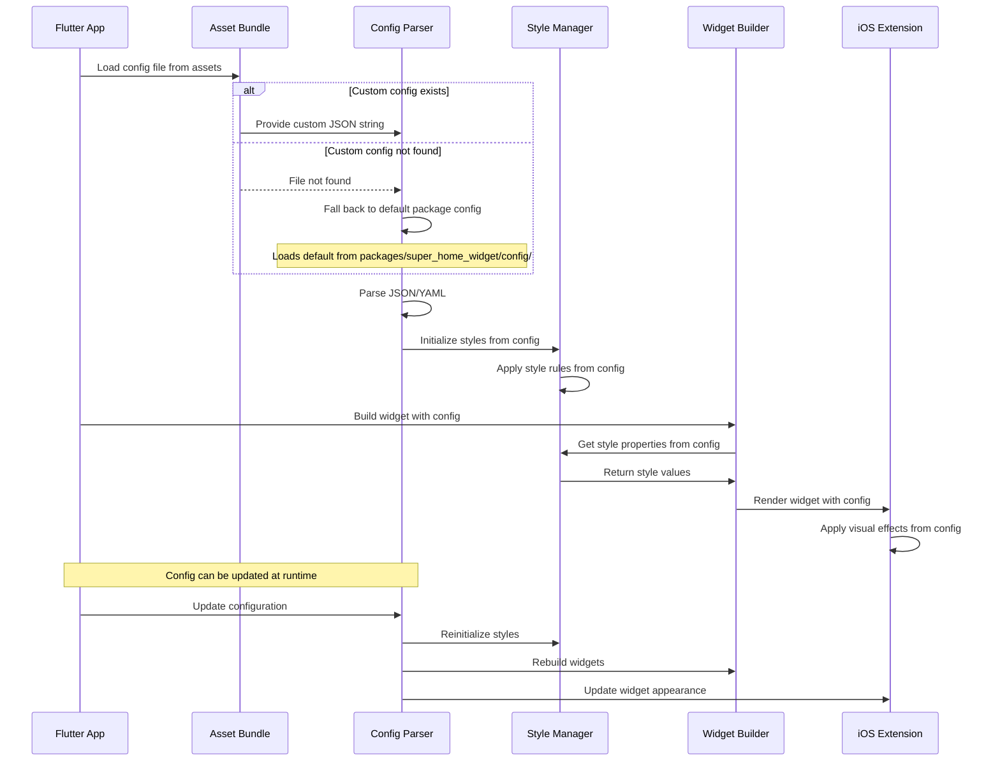

---

## Widget Types & Sizes

### iOS Widget Sizes

iOS WidgetKit supports three standard widget sizes:

1. **Small Widget** (2x2 grid cells)
   - Dimensions: ~155x155 points (iPhone)
   - Use case: Quick glance information
   - Content: Minimal, essential data only

2. **Medium Widget** (4x2 grid cells)
   - Dimensions: ~329x155 points (iPhone)
   - Use case: Detailed information display
   - Content: Expanded data with more context

3. **Large Widget** (4x4 grid cells)
   - Dimensions: ~329x345 points (iPhone)
   - Use case: Comprehensive information display
   - Content: Full details with rich content

### Widget Size Comparison

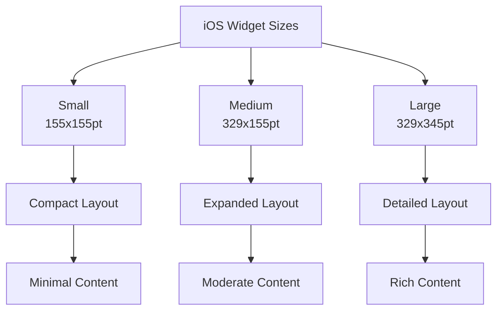

### Widget Variants

Each widget size can have multiple variants based on:
- **Content Type**: Different data displays
- **Layout Style**: Different arrangement of elements
- **Design Style**: Default or Liquid Glass

---

## Data Flow

### Widget Update Flow

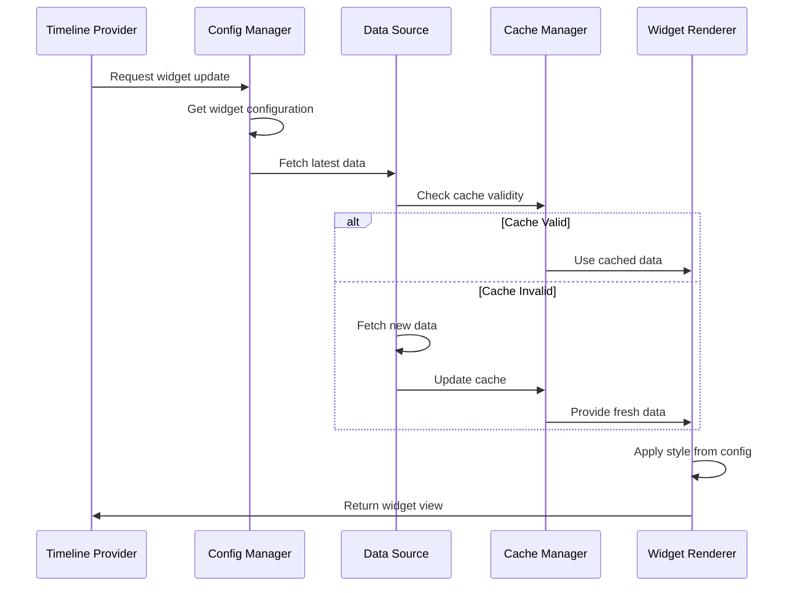

### Data Sharing Architecture

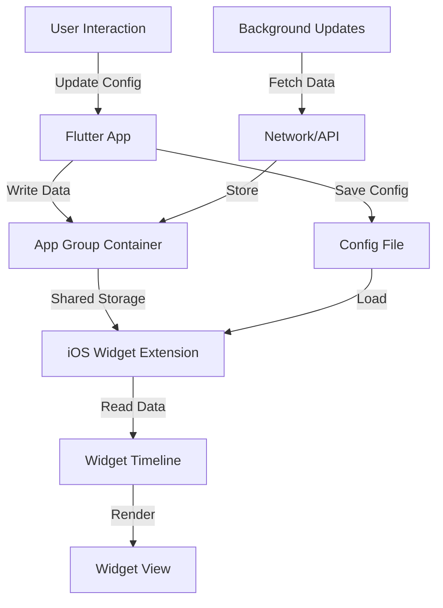

---

## Implementation Details

### Current Architecture Issues & Proposed Improvements

#### Current Implementation Structure (`lib/`)

**Actual Current Structure (As Implemented):**
```
lib/
├── super_home_widget.dart          # Main entry point, exports all public APIs
│
├── config/                          # Configuration Layer
│   ├── config_model.dart           # All configuration data models
│   │   ├── StyleConfig (abstract base)
│   │   └── LiquidGlassStyleConfig (extends StyleConfig)
│   │                                  #   - liquidGlassEnabled (default: true)
│   │   ├── LiquidGlassStyleConfig (extends StyleConfig)
│   │   ├── WidgetSize, WidgetLayout, WidgetStyleType (enums)
│   │   ├── WidgetConfig, WidgetsConfig
│   │   ├── BackgroundConfig, PaddingConfig, TypographyConfig
│   │   ├── ColorsConfig, ShadowConfig, BorderConfig
│   │   ├── GradientConfig, HighlightsConfig
│   │   └── SuperHomeWidgetConfig (main config)
│   └── config_parser.dart          # JSON configuration file parser
│
├── widgets/                         # Core Widget Layer
│   ├── widget_builder.dart        # Contains:
│   │   ├── BaseWidgetRender (abstract base class)
│   │   ├── WidgetData (domain model)
│   │   ├── WidgetDimensions (value object)
│   │   └── WidgetBuilder (factory)
│   ├── small_widget.dart          # SmallWidget (implements BaseWidgetRender)
│   ├── medium_widget.dart         # MediumWidget (implements BaseWidgetRender)
│   └── large_widget.dart          # LargeWidget (implements BaseWidgetRender)
│
├── styles/                          # Widget Style Layer
│   ├── style_manager.dart         # Contains:
│   │   ├── WidgetStyle (abstract base class)
│   │   ├── StyleManager (factory)
│   │   └── StyleBuilder (builder pattern)
│   └── liquid_glass_style.dart    # LiquidGlassStyle (implements WidgetStyle)
│                                  #   - liquidGlassEnabled flag (default: true)
│                                  #   - When false: solid background color
│
└── native/
    └── ios_bridge.dart            # IOSBridge (singleton, platform-specific)
```

**Current Architecture Characteristics:**
- ✅ **Functional**: Works correctly and provides all required features
- ✅ **Clear Separation**: Widgets and styles are separate layers
- ✅ **Composition**: Widgets use styles through composition (not inheritance)
- ✅ **Configurable**: JSON-based configuration system
- ⚠️ **Mixed Concerns**: Base classes, domain models, and implementations in same files
- ⚠️ **File Organization**: Some files contain multiple responsibilities

**Identified Issues (For Future Improvement):**
1. **Mixed Responsibilities**: Base classes (`BaseWidgetRender`, `WidgetStyle`) are in same files as implementations and factories
2. **Domain Models Location**: `WidgetData` is in `widgets/widget_builder.dart` instead of a dedicated domain layer
3. **Configuration Structure**: All config models in single file (`config_model.dart`) - could be split for better maintainability
4. **No Core Layer**: Abstract base classes are mixed with concrete implementations
5. **No Domain Layer**: Domain models (WidgetData, enums) are scattered across implementation files
6. **Testing Complexity**: While testable, clearer separation would improve testability
7. **Scalability**: Current structure works but could be improved for larger codebases

#### Proposed Clean Architecture Structure

**Recommended Structure:**
```
lib/
├── super_home_widget.dart          # Main entry point (exports only)
│
├── core/                           # Core Abstractions & Interfaces
│   ├── base_widget_render.dart     # BaseWidgetRender (abstract interface)
│   ├── widget_style.dart           # WidgetStyle (abstract interface)
│   └── style_config.dart           # StyleConfig (abstract base)
│
├── domain/                         # Domain Models & Entities
│   ├── models/
│   │   ├── widget_data.dart       # WidgetData (domain entity)
│   │   ├── widget_size.dart       # WidgetSize enum
│   │   ├── widget_layout.dart     # WidgetLayout enum
│   │   └── widget_dimensions.dart # WidgetDimensions (value object)
│   └── config/
│       ├── widget_config.dart     # WidgetConfig (domain model)
│       └── widgets_config.dart    # WidgetsConfig (domain model)
│
├── widgets/                        # Widget Implementations
│   ├── base/
│   │   └── widget_builder.dart    # WidgetBuilder (factory)
│   ├── implementations/
│   │   ├── small_widget.dart      # SmallWidget implementation
│   │   ├── medium_widget.dart     # MediumWidget implementation
│   │   └── large_widget.dart      # LargeWidget implementation
│
├── styles/                         # Style Implementations
│   ├── base/
│   │   └── style_manager.dart     # StyleManager (factory)
│   ├── implementations/
│   │   └── liquid_glass_style.dart # LiquidGlassStyle implementation
│   │   └── liquid_glass_style.dart # LiquidGlassStyle implementation
│   └── builders/
│       └── style_builder.dart     # StyleBuilder (builder pattern)
│
├── config/                         # Configuration Layer
│   ├── models/
│   │   ├── style_config_models.dart    # StyleConfig, LiquidGlassStyleConfig
│   │   ├── background_config.dart      # BackgroundConfig
│   │   ├── typography_config.dart      # TypographyConfig
│   │   ├── colors_config.dart          # ColorsConfig
│   │   ├── shadow_config.dart          # ShadowConfig
│   │   ├── border_config.dart          # BorderConfig
│   │   ├── gradient_config.dart        # GradientConfig
│   │   ├── highlights_config.dart      # HighlightsConfig
│   │   └── super_home_widget_config.dart # SuperHomeWidgetConfig
│   └── parsers/
│       └── config_parser.dart      # ConfigParser
│
└── infrastructure/                 # Infrastructure Layer
    └── native/
        └── ios_bridge.dart         # IOSBridge (platform-specific)
```

#### Architecture Benefits

**1. Clear Layer Separation:**
- **`core/`**: Pure abstractions and interfaces (no implementations)
- **`domain/`**: Business logic and domain models (framework-independent)
- **`widgets/`** & **`styles/`**: Application-specific implementations
- **`config/`**: Configuration data structures and parsing
- **`infrastructure/`**: Platform-specific implementations

**2. Dependency Direction:**
```
infrastructure → config → widgets/styles → domain → core
```
- Inner layers don't depend on outer layers
- Core has no dependencies
- Domain depends only on core
- Implementations depend on domain and core

**3. Benefits:**
- **Testability**: Each layer can be tested independently
- **Maintainability**: Clear separation of concerns
- **Scalability**: Easy to add new widgets/styles without affecting core
- **Flexibility**: Can swap implementations without changing interfaces
- **SOLID Compliance**: Single Responsibility, Dependency Inversion principles

**4. File Organization Principles:**
- **Base classes** in `core/` (interfaces only)
- **Domain models** in `domain/models/` (business entities)
- **Implementations** in `widgets/implementations/` and `styles/implementations/`
- **Factories** in `widgets/base/` and `styles/base/`
- **Configuration** separated into models and parsers
- **Infrastructure** isolated in `infrastructure/`

### Current File Structure (As Implemented)

**Note**: This section documents the actual current implementation structure. The "Proposed Architecture Layers" section below describes recommended improvements for future versions.

```
super_home_widget/
├── lib/
│   ├── super_home_widget.dart          # Main package entry point
│   │                                  # Exports all public APIs
│   │                                  # SuperHomeWidget singleton class
│   │
│   ├── config/                          # Configuration Layer
│   │   ├── config_parser.dart          # ConfigParser class
│   │   │                              # Loads and parses JSON config files
│   │   │                              # Returns SuperHomeWidgetConfig
│   │   │
│   │   └── config_model.dart          # Configuration Data Models
│   │                                  # StyleConfig (abstract base)
│   │                                  #   └── LiquidGlassStyleConfig (extends StyleConfig)
│   │                                  #   └── LiquidGlassStyleConfig (extends StyleConfig)
│   │                                  # WidgetSize, WidgetLayout, WidgetStyleType enums
│   │                                  # WidgetConfig, WidgetsConfig classes
│   │                                  # BackgroundConfig, PaddingConfig, TypographyConfig
│   │                                  # ColorsConfig, ShadowConfig, BorderConfig
│   │                                  # GradientConfig, HighlightsConfig
│   │                                  # SuperHomeWidgetConfig (main config model)
│   │
│   ├── widgets/                         # Core Widget Layer (Base Structure)
│   │   ├── widget_builder.dart        # WidgetBuilder class (factory)
│   │   │                              # BaseWidgetRender (abstract base class)
│   │   │                              #   - Defines widget interface
│   │   │                              #   - size, layout, style, data properties
│   │   │                              #   - buildNativeConfig(), getDimensions({bool isIPad = false}) methods
│   │   │                              # WidgetData class
│   │   │                              #   - title, subtitle, body, imageUrl, iconName
│   │   │                              #   - customData, timestamp
│   │   │                              # WidgetDimensions class (constants)
│   │   │
│   │   ├── small_widget.dart          # SmallWidget class
│   │   │                              # Implements BaseWidgetRender
│   │   │                              # Size: 155x155pt (iPhone) / 170x170pt (iPad)
│   │   │                              # Compact layout
│   │   │
│   │   ├── medium_widget.dart         # MediumWidget class
│   │   │                              # Implements BaseWidgetRender
│   │   │                              # Size: 329x155pt (iPhone) / 364x170pt (iPad)
│   │   │                              # Expanded layout
│   │   │
│   │   └── large_widget.dart          # LargeWidget class
│   │                                  # Implements BaseWidgetRender
│   │                                  # Size: 329x345pt (iPhone) / 364x376pt (iPad)
│   │                                  # Detailed layout
│   │
│   ├── styles/                          # Widget Style Layer (Derived Structure)
│   │   ├── style_manager.dart         # StyleManager class (factory)
│   │   │                              # WidgetStyle (abstract base class)
│   │   │                              #   - Defines style interface
│   │   │                              #   - config, styleName properties
│   │   │                              #   - toNativeConfig(), getBackgroundConfig()
│   │   │                              #   - getTypographyConfig(), getShadowConfig()
│   │   │                              #   - getPaddingConfig() methods
│   │   │                              # StyleBuilder class (builder pattern)
│   │   │
│   │   └── liquid_glass_style.dart    # LiquidGlassStyle class
│   │                                  # Implements WidgetStyle interface
│   │                                  # Uses LiquidGlassStyleConfig (from config_model.dart)
│   │                                  # Glassmorphic appearance
│   │
│   └── native/
│       └── ios_bridge.dart            # IOSBridge class (singleton)
│                                  # Native iOS communication
│                                  # Method channels for Flutter-Native bridge
│                                  # Event channels for Native-Flutter communication
│                                  # App Group container access (UserDefaults)
│                                  # Widget refresh and update methods
│                                  # Widget click event handling
├── ios/
│   ├── Classes/
│   │   ├── SuperHomeWidgetPlugin.swift    # Flutter plugin (MethodChannel handler)
│   │   ├── WidgetTimelineProvider.swift    # Timeline provider implementation
│   │   ├── WidgetView.swift                # Widget view rendering
│   │   └── StyleRenderer.swift             # Style rendering logic
│   ├── WidgetExtension/
│   │   └── WidgetBundle.swift             # Widget extension bundle
│   └── super_home_widget.podspec          # CocoaPods podspec file
│
├── config/
│   └── widget_config.json            # Default configuration file (JSON)
│
├── test/
│   └── super_home_widget_test.dart   # Unit tests
│
└── doc/
    └── analysis.md                   # This document
```

**Key Points About Current Structure:**
- ✅ **Functional**: All features work correctly and provide required functionality
- ✅ **Clear Separation**: Widgets and styles are separate layers with composition pattern
- ✅ **Configurable**: JSON-based configuration system is fully functional
- ⚠️ **Mixed Responsibilities**: Some files contain multiple classes (base classes + implementations + factories)
- ⚠️ **Organization**: Could benefit from clearer separation of concerns (see Proposed Architecture below)
- ⚠️ **Scalability**: Current structure works well but could be improved for larger codebases

### Proposed Architecture Layers

#### 1. Core Layer (`lib/core/`)

**Purpose**: Pure abstractions and interfaces - no implementations, no dependencies

**Files**:
- **`base_widget_render.dart`**: 
  - `BaseWidgetRender` (abstract interface)
  - Defines widget contract only
  - No concrete implementations
  
- **`widget_style.dart`**: 
  - `WidgetStyle` (abstract interface)
  - Defines style contract only
  - No concrete implementations
  
- **`style_config.dart`**: 
  - `StyleConfig` (abstract base class)
  - Base configuration structure
  - No concrete implementations

**Rules**:
- No imports from other layers
- No dependencies on external packages (except Dart core)
- Pure abstractions only

#### 2. Domain Layer (`lib/domain/`)

**Purpose**: Business logic and domain models - framework-independent

**Structure**:
- **`models/`**: Domain entities and value objects
  - `widget_data.dart` - WidgetData entity
  - `widget_size.dart` - WidgetSize enum
  - `widget_layout.dart` - WidgetLayout enum
  - `widget_dimensions.dart` - WidgetDimensions value object
  
- **`config/`**: Domain configuration models
  - `widget_config.dart` - WidgetConfig domain model
  - `widgets_config.dart` - WidgetsConfig domain model

**Rules**:
- Can depend on `core/` layer only
- No dependencies on implementation layers
- Framework-independent (can be used in any context)

#### 3. Widget Implementation Layer (`lib/widgets/`)

**Purpose**: Widget-specific implementations

**Structure**:
- **`base/`**: Factory and builder classes
  - `widget_builder.dart` - WidgetBuilder factory
  
- **`implementations/`**: Concrete widget implementations
  - `small_widget.dart` - SmallWidget
  - `medium_widget.dart` - MediumWidget
  - `large_widget.dart` - LargeWidget

**Rules**:
- Implements interfaces from `core/`
- Uses domain models from `domain/`
- Can use configuration from `config/`
- No direct dependencies on `styles/` implementations (uses interface)

#### 4. Style Implementation Layer (`lib/styles/`)

**Purpose**: Style-specific implementations

**Structure**:
- **`base/`**: Factory and manager classes
  - `style_manager.dart` - StyleManager factory
  
- **`implementations/`**: Concrete style implementations
  - `liquid_glass_style.dart` - LiquidGlassStyle
  - `liquid_glass_style.dart` - LiquidGlassStyle
  
- **`builders/`**: Builder pattern classes
  - `style_builder.dart` - StyleBuilder

**Rules**:
- Implements interfaces from `core/`
- Uses configuration models from `config/`
- Independent of widget implementations

#### 5. Configuration Layer (`lib/config/`)

**Purpose**: Configuration data structures and parsing

**Structure**:
- **`models/`**: Configuration data models
  - `style_config_models.dart` - StyleConfig hierarchy
  - `background_config.dart` - BackgroundConfig
  - `typography_config.dart` - TypographyConfig
  - `colors_config.dart` - ColorsConfig
  - `shadow_config.dart` - ShadowConfig
  - `border_config.dart` - BorderConfig
  - `gradient_config.dart` - GradientConfig
  - `highlights_config.dart` - HighlightsConfig
  - `super_home_widget_config.dart` - SuperHomeWidgetConfig
  
- **`parsers/`**: Configuration parsing
  - `config_parser.dart` - ConfigParser

**Rules**:
- Can depend on `domain/` and `core/`
- Provides data structures for other layers
- Handles JSON parsing and validation

#### 6. Infrastructure Layer (`lib/infrastructure/`)

**Purpose**: Platform-specific implementations

**Structure**:
- **`native/`**: Native platform bridge
  - `ios_bridge.dart` - IOSBridge

**Rules**:
- Can depend on all other layers
- Platform-specific code only
- Handles external system communication

### Migration Strategy

**Phase 1: Extract Core Abstractions**
1. Create `lib/core/` directory
2. Move `BaseWidgetRender` to `core/base_widget_render.dart`
3. Move `WidgetStyle` to `core/widget_style.dart`
4. Move `StyleConfig` to `core/style_config.dart`

**Phase 2: Extract Domain Models**
1. Create `lib/domain/models/` directory
2. Move `WidgetData` to `domain/models/widget_data.dart`
3. Move enums to `domain/models/`
4. Move `WidgetDimensions` to `domain/models/widget_dimensions.dart`

**Phase 3: Reorganize Implementations**
1. Create `lib/widgets/implementations/` directory
2. Move widget implementations to new structure
3. Create `lib/styles/implementations/` directory
4. Move style implementations to new structure

**Phase 4: Separate Configuration**
1. Split `config/` into `models/` and `parsers/`
2. Separate configuration models into individual files
3. Move parser to `parsers/` directory

**Phase 5: Update Imports**
1. Update all import statements
2. Update exports in `super_home_widget.dart`
3. Run tests and fix any breaking changes

### Comparison: Current vs Proposed

| Aspect | Current Structure | Proposed Structure |
|--------|------------------|-------------------|
| **Base Classes** | Mixed with implementations | Separate `core/` layer |
| **Domain Models** | Mixed with implementations | Separate `domain/` layer |
| **Configuration** | Models + parser together | Separated into `models/` and `parsers/` |
| **Widgets** | Base + implementations together | Separated into `base/` and `implementations/` |
| **Styles** | Base + implementations together | Separated into `base/` and `implementations/` |
| **Testability** | Difficult (tight coupling) | Easy (clear separation) |
| **Scalability** | Hard to extend | Easy to extend |
| **SOLID Compliance** | Violated | Compliant |
| **Dependency Direction** | Circular dependencies possible | Clear unidirectional flow |

### Layer Separation & File Organization

#### 1. Core Widget Layer (`lib/widgets/`)

**Purpose**: Independent widget structure handling widget-specific functionality

**Files**:
- **`widget_builder.dart`**: 
  - `BaseWidgetRender` (abstract base class) - Core widget interface
  - `WidgetData` - Widget data model
  - `WidgetDimensions` - Dimension constants
  - `WidgetBuilder` - Factory for creating widgets
  
- **`small_widget.dart`**: 
  - `SmallWidget` - Implements `BaseWidgetRender`
  
- **`medium_widget.dart`**: 
  - `MediumWidget` - Implements `BaseWidgetRender`
  
- **`large_widget.dart`**: 
  - `LargeWidget` - Implements `BaseWidgetRender`

**Responsibilities**:
- Widget size and layout management
- Data structure and content organization
- Dimension calculations (iPhone/iPad)
- Native configuration building
- Content layout configuration

**Dependencies**:
- Uses `WidgetStyle` interface (abstraction, defined in `styles/style_manager.dart`)
- Uses `WidgetConfig`, `WidgetSize`, `WidgetLayout` (from `config/config_model.dart`)
- No direct dependency on style implementations

#### 2. Widget Style Layer (`lib/styles/`)

**Purpose**: Separate style structure that derives from base style configuration

**Files**:
- **`style_manager.dart`**: 
  - `WidgetStyle` (abstract base class) - Style interface
  - `StyleManager` - Factory for creating styles
  - `StyleBuilder` - Builder pattern for custom styles
  
- **`liquid_glass_style.dart`**: 
  - `LiquidGlassStyle` - Implements `WidgetStyle`
  - Uses `LiquidGlassStyleConfig` (from `config/config_model.dart`)

**Responsibilities**:
- Visual appearance (backgrounds, colors, typography)
- Shadow and border effects
- Style-specific rendering properties
- Native style configuration generation

**Dependencies**:
- Uses `StyleConfig` hierarchy (from `config/config_model.dart`)
  - `StyleConfig` (abstract base)
  - `LiquidGlassStyleConfig` extends `StyleConfig`
    - Contains `liquidGlassEnabled` boolean (default: `true`)
    - When `false`, uses solid background color
- Independent of core widget implementations

#### 3. Configuration Layer (`lib/config/`)

**Purpose**: Configuration data models and parsing

**Files**:
- **`config_model.dart`**: 
  - `StyleConfig` (abstract base class) - Base style configuration
  - `LiquidGlassStyleConfig` extends `StyleConfig` - Liquid glass style config
    - `liquidGlassEnabled` boolean (default: `true`)
    - When `true`: Frosted glass effect with blur
    - When `false`: Solid background color from `background.color`
  - Supporting config classes:
    - `BackgroundConfig`, `PaddingConfig`, `TypographyConfig`
    - `ColorsConfig`, `ShadowConfig`, `BorderConfig`
    - `GradientConfig`, `HighlightsConfig`
  - `WidgetSize`, `WidgetLayout`, `WidgetStyleType` enums
  - `WidgetConfig`, `WidgetsConfig` classes
  - `SuperHomeWidgetConfig` - Main configuration container
  
- **`config_parser.dart`**: 
  - `ConfigParser` - Loads and parses JSON configuration files
  - Returns `SuperHomeWidgetConfig` instances

**Responsibilities**:
- Define configuration data structures
- Provide base classes for style configurations
- Parse JSON configuration files
- Validate configuration data

#### 4. Native Bridge Layer (`lib/native/`)

**Purpose**: iOS native communication bridge

**Files**:
- **`ios_bridge.dart`**: 
  - `IOSBridge` class (singleton pattern)
  - Method channel: `com.superhomewidget/widget` (Flutter → Native)
  - Event channel: `com.superhomewidget/events` (Native → Flutter)
  - App Group container management (UserDefaults with suite name)
  - Widget data and configuration updates
  - Widget refresh management
  - Widget click event handling
  - Timeline registration

**Responsibilities**:
- Handle all Flutter-to-native communication
- Manage App Group shared container
- Provide widget refresh capabilities
- Handle widget interaction events

### File Naming Conventions

**Core Widget Files** (`lib/widgets/`):
- `widget_builder.dart` - Contains base widget classes and builder
- `small_widget.dart` - Small widget implementation
- `medium_widget.dart` - Medium widget implementation  
- `large_widget.dart` - Large widget implementation

**Style Files** (`lib/styles/`):
- `style_manager.dart` - Contains base style interface and manager
- `liquid_glass_style.dart` - Liquid glass style implementation
- `liquid_glass_style.dart` - Liquid glass style implementation

**Config Files** (`lib/config/`):
- `config_model.dart` - All configuration data models
- `config_parser.dart` - Configuration file parser

**Naming Pattern**:
- Base classes: `BaseWidgetRender`, `WidgetStyle`, `StyleConfig`
- Concrete implementations: `SmallWidget`, `LiquidGlassStyle`, `LiquidGlassStyleConfig`
- Manager classes: `WidgetBuilder`, `StyleManager`, `ConfigParser`
- Data classes: `WidgetData`, `WidgetConfig`, `BackgroundConfig`

### Class Diagram

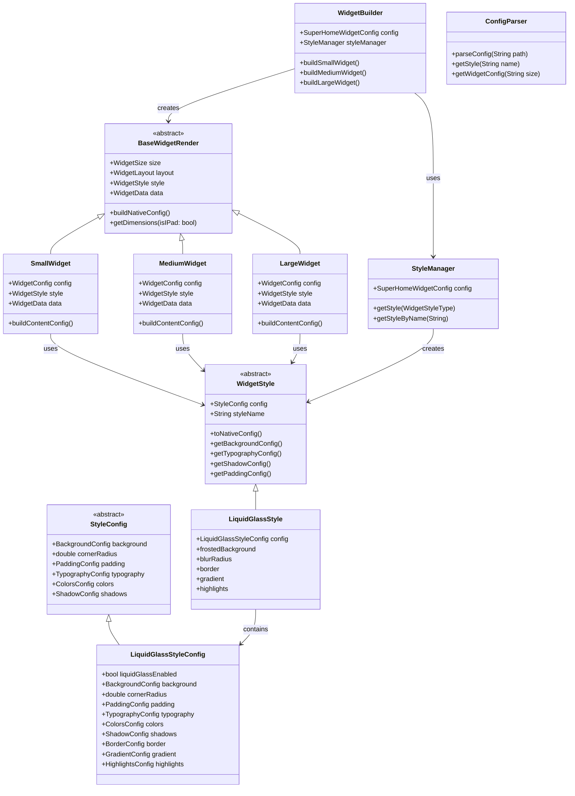

---

## Technical Specifications

### iOS Requirements

- **Minimum iOS Version**: iOS 14.0+ (WidgetKit minimum requirement)
- **Framework**: WidgetKit
- **App Groups**: Required for data sharing between app and widget extension
- **Capabilities**: 
  - Background Modes (Background fetch)
  - App Groups
  - Widget Extension target

**Important**: The app's iOS deployment target must be set to **iOS 14.0 or higher** in:
- `ios/Podfile`: `platform :ios, '14.0'`
- Xcode project settings: `IPHONEOS_DEPLOYMENT_TARGET = 14.0`
- If not set correctly, CocoaPods will fail with deployment target mismatch error

### Flutter Integration

- **Platform Channels**: Method channels for Flutter-to-native communication
  - Method channel: `com.superhomewidget/widget`
  - Event channel: `com.superhomewidget/events`
- **Native Bridge**: `IOSBridge` class (singleton) handles all native communication
- **App Groups**: For data sharing with widget extension (UserDefaults with suite name)
- **No Code Generation Required**: All JSON serialization is manual (`fromJson`/`toJson`)

### Performance Considerations

1. **Widget Refresh Limits**
   - iOS limits widget updates to preserve battery
   - Timeline-based updates recommended
   - Maximum refresh interval: 15 minutes

2. **Memory Constraints**
   - Widget extensions have limited memory
   - Efficient image caching required
   - Optimize rendering operations

3. **Rendering Performance**
   - Liquid glass effects can be computationally expensive
   - Use efficient blur algorithms
   - Cache rendered views when possible

### Security Considerations

- Configuration files should be validated
- Sanitize user-provided data
- Secure storage for sensitive information
- App Group container security

---

## Configuration Schema Reference

### Style Configuration Schema

**File**: `lib/config/config_model.dart`

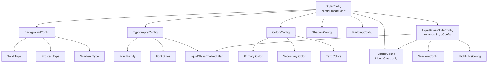

**Classes** (`config_model.dart`):
- `StyleConfig` (abstract base)
- `LiquidGlassStyleConfig` extends `StyleConfig`
  - Contains `liquidGlassEnabled` boolean (default: `true`)
  - When `true`: Frosted glass effect with blur
  - When `false`: Solid background color from `background.color`
- Supporting configs: `BackgroundConfig`, `TypographyConfig`, `ColorsConfig`, `ShadowConfig`, `PaddingConfig`, `BorderConfig`, `GradientConfig`, `HighlightsConfig`

### Widget Configuration Schema

**File**: `lib/config/config_model.dart`

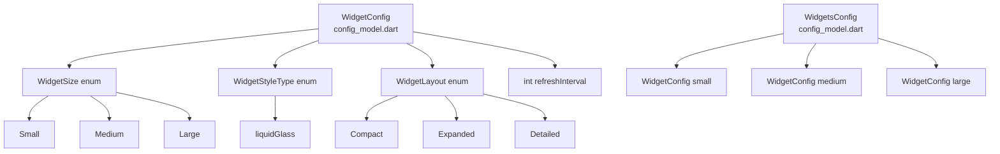

**Classes** (`config_model.dart`):
- `WidgetSize` enum: `small`, `medium`, `large`
- `WidgetLayout` enum: `compact`, `expanded`, `detailed`
- `WidgetStyleType` enum: `liquidGlass` (single style type)
- `WidgetConfig`: Single widget configuration
- `WidgetsConfig`: Container for all widget configurations
- `SuperHomeWidgetConfig`: Main configuration container

---

## Future Enhancements

### Potential Features

1. **Additional Design Styles**
   - Dark mode variants
   - Custom theme support
   - Animated style transitions

2. **Advanced Configurations**
   - Dynamic style switching
   - User-customizable themes
   - A/B testing support

3. **Performance Optimizations**
   - Lazy loading
   - Progressive rendering
   - Advanced caching strategies

4. **Developer Tools**
   - Config file validator
   - Style preview tool
   - Widget simulator

---

## Conclusion

Super Home Widget provides a flexible, configurable solution for iOS home screen widgets with a liquid glass design style. The architecture follows a clear separation of concerns:

### Architecture Summary

1. **Core Widget Structure (Base Layer)** - `lib/widgets/`
   - **Base Class**: `BaseWidgetRender` (abstract) → `widget_builder.dart`
   - **Implementations**: 
     - `SmallWidget` → `small_widget.dart`
     - `MediumWidget` → `medium_widget.dart`
     - `LargeWidget` → `large_widget.dart`
   - **Factory**: `WidgetBuilder` → `widget_builder.dart`
   - Handle widget-specific functionality: size, layout, data, dimensions
   - No dependency on style implementations
   - Use `WidgetStyle` interface through composition

2. **Widget Style Structure (Derived Layer)** - `lib/styles/`
   - **Base Class**: `WidgetStyle` (abstract) → `style_manager.dart`
   - **Implementations**: 
     - `LiquidGlassStyle` → `liquid_glass_style.dart`
   - **Factory**: `StyleManager` → `style_manager.dart`
   - **Configuration Base**: `StyleConfig` (abstract) → `config/config_model.dart`
   - **Configuration Implementation**:
     - `LiquidGlassStyleConfig` → `config/config_model.dart` (extends `StyleConfig`)
       - Contains `liquidGlassEnabled` boolean (default: `true`)
       - When `false`, uses solid background color
   - Completely independent from core widget structure
   - Can be extended without modifying widgets

3. **Configuration Layer** - `lib/config/`
   - **Models**: `config_model.dart` - All configuration data models
   - **Parser**: `config_parser.dart` - JSON configuration file parser
   - Contains base style configuration classes
   - Provides data models for both widgets and styles

4. **Native Bridge Layer** - `lib/native/`
   - **Bridge**: `ios_bridge.dart` - `IOSBridge` class (singleton)
   - Method channels for Flutter-to-native communication
   - Event channels for native-to-Flutter communication
   - App Group container management
   - Widget refresh and update capabilities

5. **iOS Native Implementation** - `ios/Classes/` and `ios/WidgetExtension/`
   - **Plugin**: `SuperHomeWidgetPlugin.swift` - Flutter plugin handler
   - **Timeline**: `WidgetTimelineProvider.swift` - WidgetKit timeline provider
   - **Views**: `WidgetView.swift` - SwiftUI widget views
   - **Renderer**: `StyleRenderer.swift` - Style rendering utilities
   - **Bundle**: `WidgetBundle.swift` - Widget extension bundle

6. **Separation Benefits**
   - Widgets and styles are decoupled
   - Any widget can use any style
   - New styles can be added by:
     - Extending `StyleConfig` in `config_model.dart`
     - Implementing `WidgetStyle` in a new file in `styles/` directory
   - Core widgets remain unchanged when adding new styles
   - Clear inheritance hierarchy: 
     - `StyleConfig` (abstract) → `LiquidGlassStyleConfig`
     - `WidgetStyle` (abstract) → `LiquidGlassStyle`
     - `liquidGlassEnabled` flag controls glass effect (default: `true`)
     - When `false`, uses solid background color
     - `BaseWidgetRender` (abstract) → `SmallWidget`/`MediumWidget`/`LargeWidget`
   - Clear file organization:
     - Core widgets: `lib/widgets/`
     - Widget styles: `lib/styles/`
     - Configuration: `lib/config/`

The configuration-driven approach allows for easy customization and maintenance, while the separation of concerns ensures clean architecture and extensibility. The package leverages iOS WidgetKit's capabilities while providing a Flutter-friendly API, making it accessible to Flutter developers while maintaining native iOS performance and appearance standards.

### Architecture Improvement Recommendations

**Current State**: The existing `lib/` structure has several architectural issues:
- Base classes mixed with implementations
- Domain models scattered across implementation files
- Configuration models and parsers in same directory
- Poor separation of concerns
- Difficult to test and extend

**Recommended Structure**: A Clean Architecture approach with clear layer separation:
- **`core/`**: Pure abstractions (interfaces only)
- **`domain/`**: Business logic and domain models
- **`widgets/`** & **`styles/`**: Implementation layers with clear separation
- **`config/`**: Configuration separated into models and parsers
- **`infrastructure/`**: Platform-specific code isolated

**Benefits**:
- Clear dependency direction (inner → outer)
- Easy to test (each layer independently)
- Easy to extend (add new implementations without changing core)
- SOLID principles compliance
- Better maintainability and scalability

**Migration Path**: The proposed structure can be migrated incrementally:
1. Extract core abstractions
2. Extract domain models
3. Reorganize implementations
4. Separate configuration
5. Update imports and exports

This architectural improvement will make the codebase more maintainable, testable, and scalable for future development.
